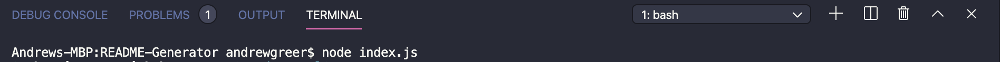
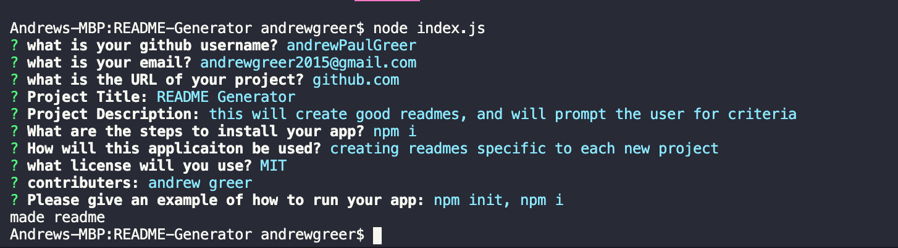
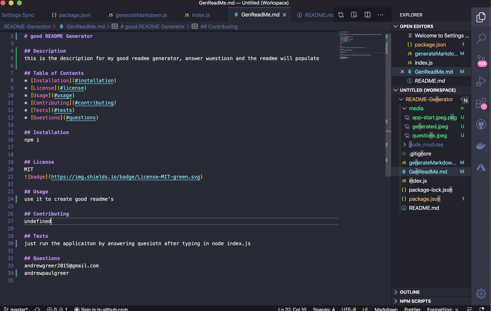

# Good README Generator

## Description
This readme is for the homework assigned to create a good readme generator

## Table of Contents
* [Installation](#installation)
* [License](#license)
* [Usage](#usage)
* [Contributing](#contributing)
* [Tests](#tests)
* [Questions](#questions)

## Installation
run NPM i

## License
![badge]{https://img.shields.io/badge/License-MIT-blue.svg}

## Usage
first start by running node index.js

then answer questions

then find your readme that has been generated

## Contributing
Andrew Greer

## Tests 
run NPM i, and ask questions for this applicaiotn

## Questions
Email: andrewgreer2015@gmail.com
Github: andrewpaulgreer

